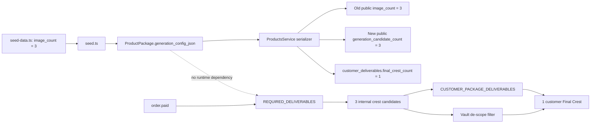

# Product API `image_count` Dependency Audit

Audit date: 2026-07-16

## Finding

`generation_config.image_count = 3` is a legacy seed/configuration value. It is exposed by the Product API but has no runtime reader in image generation, orders, checkout, ZIP assembly, Vault, downloads, monitoring, or customer-facing web code.

Classification:

- Stored field: `LEGACY_UNUSED_FIELD`
- Historical semantic meaning: three internal generation candidates
- Correct public expression: `generation_candidate_count`
- Customer deliverable count: independently reported as `customer_deliverables.final_crest_count = 1`

## Source and writes

1. `packages/database/prisma/seed-data.ts` defines `generationConfigJson.image_count` as `3`.
2. `packages/database/prisma/seed.ts` writes the full `generationConfigJson` object during package create/update.
3. `packages/database/prisma/schema.prisma` stores the object in `ProductPackage.generationConfigJson` / `generation_config_json`.

No order or fulfillment code writes this key.

## Reads

The only runtime read path is:

```text
ProductPackage.generationConfigJson
  -> apps/api/src/products/products.service.ts
  -> customerSafeGenerationConfig()
  -> GET /api/v1/products response
```

`packages/domain/src/house-identity/types.ts` declares an optional `image_count` preference type, but no production call site reads that property.

## Independent generation path

```text
order.paid
  -> processOrderPaidOutbox()
  -> createExpectedAssets()
  -> REQUIRED_DELIVERABLES (hardcoded)
  -> runManifestDrivenGeneration()
  -> three internal crest variant assets plus PDFs and ZIP
```

`REQUIRED_DELIVERABLES` is defined in `packages/database/src/orchestration/pipeline.ts`. It does not load `generationConfigJson` or `image_count`.

## Customer delivery path

```text
generated assets
  -> CUSTOMER_PACKAGE_DELIVERABLES
  -> crest_variant_1_png + three PDFs
  -> download_package_zip

Vault list
  -> CUSTOMER_DE_SCOPED_DELIVERABLES
  -> filters crest_variant_2_png and crest_variant_3_png
```

The Product API independently filters its deliverable list to one crest, three PDFs, and one complete archive.

## Dependency graph



## Impact conclusion

- Customer delivery affected by the legacy field: **NO**
- Generation pipeline affected by the legacy field: **NO**
- Checkout affected: **NO**
- ZIP affected: **NO**
- Vault/download affected: **NO**
- Monitoring affected: **NO**, except the misleading API interpretation
- Safe public serialization fix possible: **YES**

The database value remains unchanged so rollback is one serializer revert and no migration is required.
